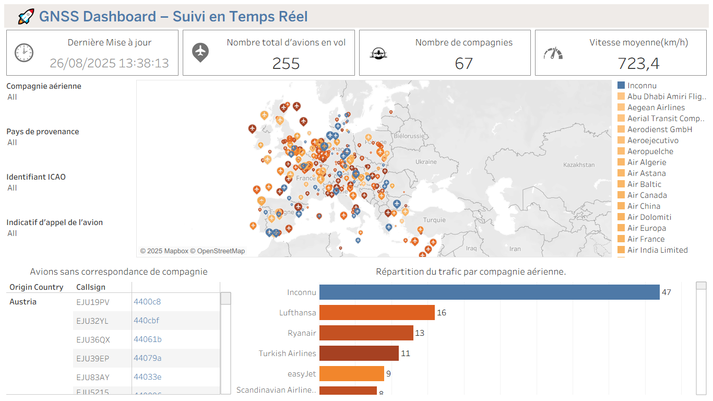

# ✈️ OpenSky → Kafka → Postgres  → Tableau Pipeline

## 📌 Description
Ce projet collecte en temps réel des données de vol depuis l’API **OpenSky Network**, 
les publie dans **Apache Kafka** (Confluent Cloud), puis les synchronise dans une base **Postgres** (hébergée sur Neon).

L’objectif est de construire une pipeline **data engineering** moderne, inspirée de cas réels.
---

## Apercu du Résultat


## 🏗️ Architecture

# Flux de données OpenSky → Kafka → Postgres → Tableau


- **Producer Python** : récupère les données OpenSky et les envoie vers Kafka.  
- **Kafka Confluent Cloud** : ingère les messages Avro (key + value) et versionne les schémas via Schema Registry.  
- **Postgres (Neon)** : stockage persistant via Kafka Connect Sink.  
- **Visualisation** : Tableau pour visualiser les données.

---

## 🗂️ Structure du projet

 `opensky-kafka-pipeline`

```text
opensky-kafka-pipeline/
│── .github/
│   └── workflows/
│       └── pipeline.yml        # GitHub Actions workflow (scheduler)
│
│── config/
│   ├── confluent_config.json   # Credentials Confluent Cloud + Kafka topic
│   └── neon_config.json        # Optionnel si besoin Postgres direct
│
│── src/
│   ├── producer.py             # Code du producer Kafka
│   ├── fetch_opensky.py        # Fonction pour requêter l'API OpenSky
│   ├── utils.py                # Fonctions utilitaires (log, retry…)
│   └── __init__.py
│
│── requirements.txt            # Dépendances Python
│── README.md                   # Documentation projet
│── LICENSE                     # Licence (ex: MIT)
```


---

## 🚀 Installation locale

1. Cloner le repository :
```bash
git clone https://github.com/<ton-repo>/opensky-kafka-pipeline.git
cd opensky-kafka-pipeline
```
2. Installer les dépendances :
```bash
pip install -r requirements.txt
```
3. Créer le fichier config/confluent_config.json manuellement (si test local) :
```json
{
  "bootstrap.servers": "<TON_BOOTSTRAP_SERVERS>",
  "security.protocol": "SASL_SSL",
  "sasl.mechanism": "PLAIN",
  "sasl.username": "<TON_USERNAME>",
  "sasl.password": "<TON_PASSWORD>",
  "schema.registry.url": "<TON_SCHEMA_REGISTRY_URL>",
  "basic.auth.user.info": "<TON_SCHEMA_AUTH>",
  "topic": "aircraft-states"
}
```
## ▶️ Lancer le producer localement
```bash
python src/producer.py
```
Le producer récupère les données OpenSky toutes les 5 minutes et les publie sur Kafka.


-----
## ☁️ Scheduler GitHub Actions

Le pipeline est automatisé avec GitHub Actions et sécurisé :

- Le fichier config/confluent_config.json est généré à l’exécution à partir des Secrets GitHub.
- Pas de credentials en clair dans le repo.
- Planification via cron (ex. toutes les 15 minutes).

### Exemple de workflow **.github/workflows/producer.yml**
```yaml
name: Run Kafka Producer

on:
  schedule:
    - cron: "*/15 * * * *"
  workflow_dispatch:

jobs:
  run-producer:
    runs-on: ubuntu-latest

    steps:
      - name: Checkout repository
        uses: actions/checkout@v3

      - name: Set up Python
        uses: actions/setup-python@v4
        with:
          python-version: "3.10"

      - name: Install dependencies
        run: |
          python -m pip install --upgrade pip
          pip install -r requirements.txt

      - name: Create confluent config from secrets
        run: |
          mkdir -p config
          cat > config/confluent_config.json <<EOL
          {
            "bootstrap.servers": "${{ secrets.BOOTSTRAP_SERVERS }}",
            "security.protocol": "SASL_SSL",
            "sasl.mechanism": "PLAIN",
            "sasl.username": "${{ secrets.SASL_USERNAME }}",
            "sasl.password": "${{ secrets.SASL_PASSWORD }}",
            "schema.registry.url": "${{ secrets.SCHEMA_REGISTRY_URL }}",
            "basic.auth.user.info": "${{ secrets.SCHEMA_REGISTRY_AUTH }}",
            "topic": "${{ secrets.TOPIC }}"
          }
          EOL

      - name: Run Kafka Producer
        run: python src/producer.py
```
## 🔹 GitHub Secrets nécessaires

- BOOTSTRAP_SERVERS
- SASL_USERNAME
- SASL_PASSWORD
- SCHEMA_REGISTRY_URL
- SCHEMA_REGISTRY_AUTH
- TOPIC

## 📊 Cas d’usage

- Détection des vols entrants dans une région donnée.
- Alerte sur trajectoires anormales ou perte de signal.
- Archivage et analyse du trafic aérien en temps réel.

# opensky-kafka-pipeline
